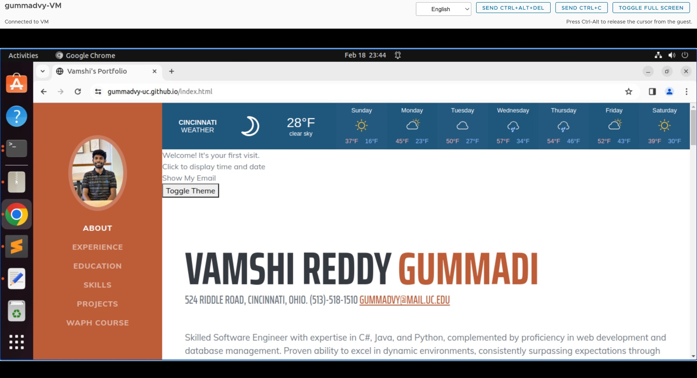
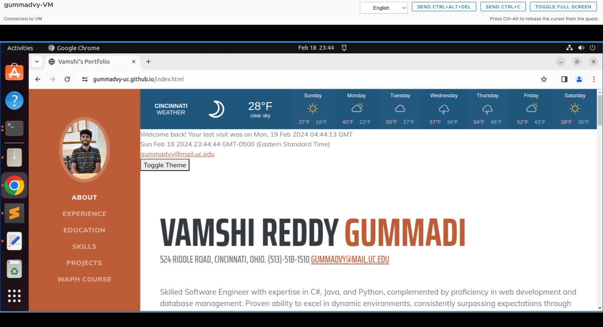
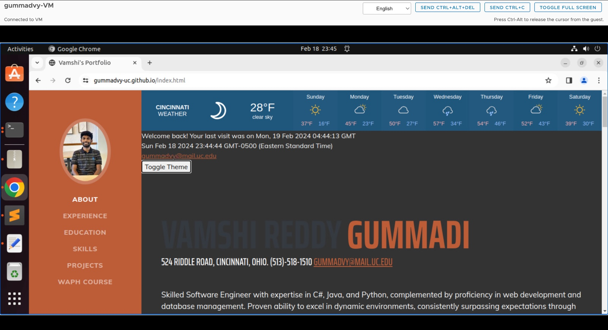
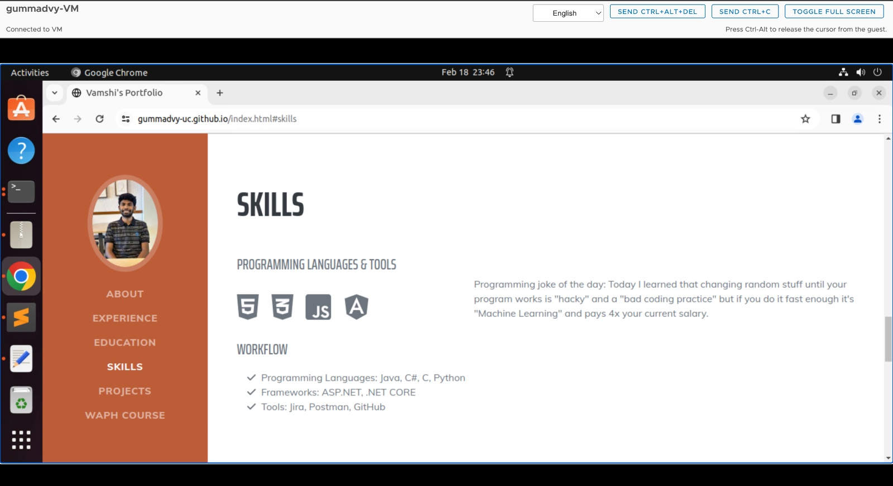
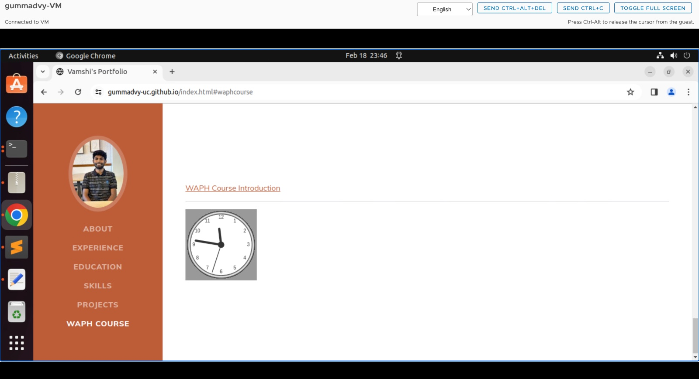
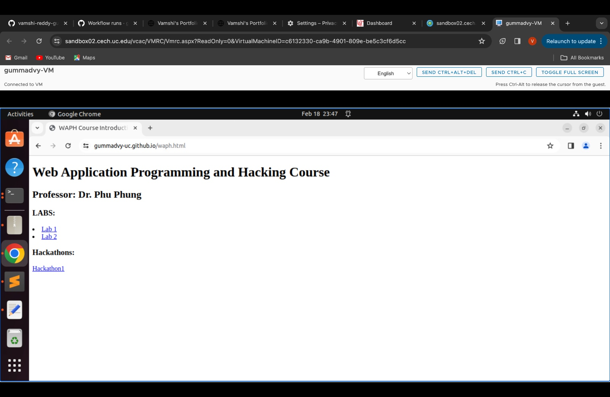
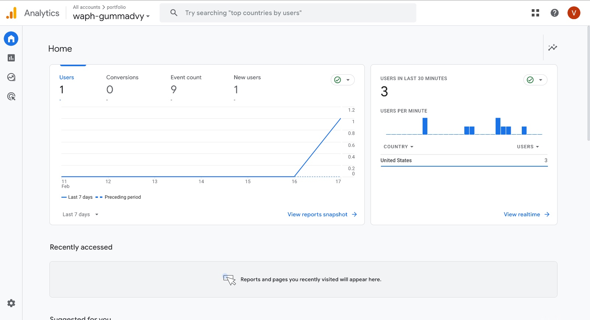

# WAPH - Web Application Programming and Hacking

## Instructor: Dr. Phu Phung

## Student 

Name : Vamshi Reddy Gummadi
Email : gummadvy@mail.uc.edu

Headshot : 
 

## Repository information for Lab-1

*Repository URL* : [https://github.com/gummadvy-uc/gummadvy-uc.github.io](https://github.com/gummadvy-uc/gummadvy-uc.github.io)

*Professional Webpage* : [https://gummadvy-uc.github.io/](https://gummadvy-uc.github.io/)

## Summary of the Project

This project involves html, css, bootstrap, js to create a professional webpage. I have added google analytics to check the analytics of the website. Also, I have added toggle button to change the color of the whole page. I have also added cookies to the webistes and web apis to get the data from the APIs.

### General Requirements
- Deployed a website with the url gummadvy-uc.github.io
- Created a html page with bootstrap,css, js to add more functionality to the website.
- I have also created a link to the webpage which having the introduction of WAPH Course.

### Non-Technical Requiremnts
-  I have taken the existing bootrsp from the google to create my webpage.
- I have created a google analytics to check the analytics
### Technical Requirements

##### Two Public APIs

- I have added joke API using jQuery
- I have make use of Weather API to show the weather in cincinnati

##### JavaScript Code
- I have added JS code to show the current date and time when clicked.
- I have added analog clock using JS to show on the webpage.
- I have added hide/show email when clicked.
- I have added react js to change the whole color of the webiste from white background to Black background.

##### Javascript cookies
- I have added the code to check the cookies to display the last visit of the user.For the first time it shows no timing.

- 
- 
- 
- 
- 
- 
- 